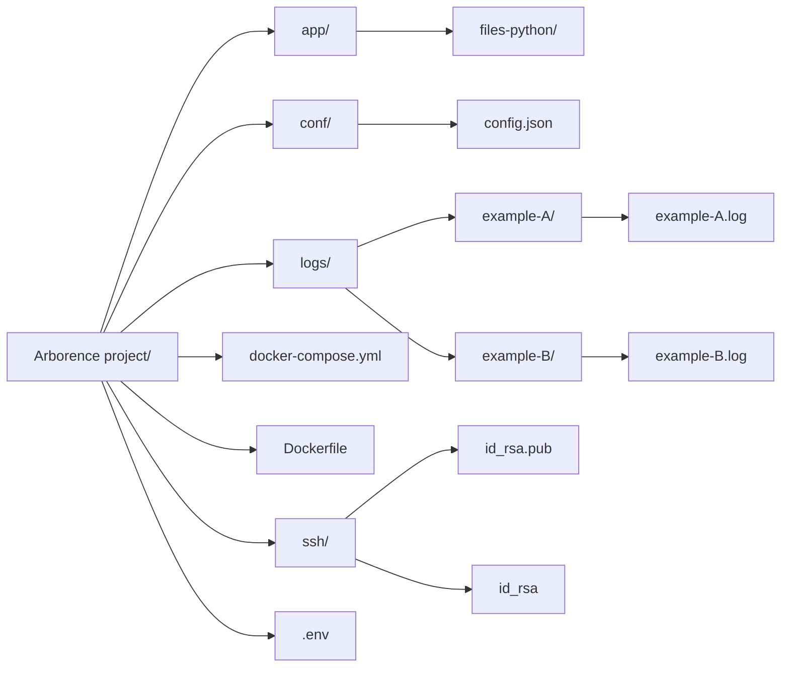

# MQTT Logger - Centralisation de logs MQTT dans des fichiers

Ce projet permet de centraliser et d'archiver tous les logs envoyés via MQTT dans des fichiers locaux, avec rotation et upload régulier vers un serveur distant via `rsync`.  
Et prochainer une page web qui affiche les logs.

---

## 📊 Objectifs

- Centraliser les logs de plusieurs projets peux import leur language via MQTT.
- Ecrire les logs dans des fichiers distincts par topic, renseigné dans topics de config.json.
- Surveiller le fichier de configuration en temps réel (🔄 hot-reload).
- Transfert automatique des logs vers un serveur distant via `rsync` + `ssh`.

---

## 📂 Structure



---

## 📁 Exemple de configuration `config.json`

```json
{
  "mqtt": {
    "broker": "192.168.1.2",							// IP broker
    "port_ws": 9001,									// Port websocet 
    "username": "user",									// Username broker
    "password": "pass"									// Password broker
  },
  "topics": [											// Topics a suivre
    "debug/example-A",
    "debug/example-B"
  ],
  "logging": {											// Configurations Logger
    "base_dir": "./logs",
    "max_bytes": 1000000,
    "backup_count": 5
  },
  "rsync": {											// Configuration rsync
    "enabled": true,
    "remote_path": "user@nas:/volume1/mqtt-logs/",
    "interval_sec": 3600
  }
}
```

---

## ⚖️ Générer la clé SSH dans `./ssh`

```bash
mkdir -p ssh
ssh-keygen -t rsa -b 4096 -f ./ssh/logs_mqtt_id_rsa -N ""
```

Cela va créer deux fichiers :
- `ssh/logs_mqtt_id_rsa` (privée)
- `ssh/logs_mqtt_id_rsa.pub` (publique)

### Ajouter la clé publique sur le serveur distant

```bash
ssh-copy-id -i ./ssh/logs_mqtt_id_rsa.pub user@nas
```

> ⚠️ Assurez-vous que le port SSH est ouvert et autorise l'utilisateur.

---

## 🧰 Variables `.env`
UID ET GUID inséré automatiquement avec run.sh

```dotenv
UID=1000
GID=1000
TZ=Europe/Paris
```

---

## 🚀 Déploiement

### Lancer le projet :

```bash
Avoir les bon droits sur le la clef privee !
chmod 600 ssh/logs_mqtt_id_rsa
./run.sh  # Gère la création des dossiers + docker-compose up
```

### Extrait du `docker-compose.yml`

```yaml
services:
  mqtt-logger:
    build:
      context: .
      args:
        UID: ${UID}
        GID: ${GID}
    environment:
      - TZ=${TZ}
    volumes:
      - ./logs:/app/logs								# repertoire de stockage des logs
      - ./conf:/app/conf								# Repertoire de la config avec dedans config.json
      - ./ssh/logs_mqtt_id_rsa:/app/.ssh/id_rsa:ro		# Clef ssh pour rsync
    env_file:
      - .env
    restart: unless-stopped
```

---

## 🛡️ Rotation des logs

Par défaut :
- Taille max : `1 Mo`
- Nombre de fichiers : `5`

> Peut être ajusté dans `config.json`

---

## 🚀 Intégration facile

### Dans n'importe quel script Python :

```python
import paho.mqtt.publish as publish
publish.single("debug/mon-service", "Hello log", hostname="192.168.1.2", port=9001)
```

Ensuite intégrer le topic `debug/mon-service` dans les topics de config.json 

### Pour braucoup de logs :
Creation d'un vraie client pour optimiser et éviter les connect publish et disconnect avec `publish.signle`

```python
import paho.mqtt.client as mqtt

client = mqtt.Client(transport="websockets")
client.connect("192.168.1.2", 9001)
client.loop_start()

client.publish("debug/mon-service", "Hello log")

# client.loop_stop() et client.disconnect() quand fini
```
---

## ✨ Résultat

- Tous les logs MQTT sont regroupés dans `logs/`
- Chaque topic a son propre dossier .
- Possibilité de sauvegarde automatique via `rsync` a différentes intervalle.
- Configuration modifiable à chaud (watchdog).

---

## 🚀 Idées futures

- Dashboard Web pour consulter les logs ?
- Compresser et purger les anciens logs automatiquement.
- Authentification forte pour les logs distants.
- Authentification broker par clef
- Ajout support ssl pour le broker

# 🔐 Projet de Sécurisation du Broker MQTT

## 🧠 Objectif

Mettre en place une gestion **sécurisée, dynamique et granulaire** du broker MQTT (Mosquitto) :
- 🔑 Authentification par **certificat TLS**
- 🛂 Gestion des **droits par utilisateur**
- 🎟️ Système de **licences**
- 🌐 Interface Web de gestion
- 📦 Intégration facile avec les autres projets (API, ESP32, Logger...)

---

## ✅ Ce que le système devra permettre

### 🔐 1. Authentification par certificat
- Utilisation de **certificats clients TLS**
- Validation automatique ou manuelle des requêtes d'accès

### 📜 2. ACL (droits par utilisateur)
- Contrôle **lecture / écriture** par topic
- Exemples :
  - `viewer` ➜ lecture seule sur `logs/#`
  - `logger_esp32` ➜ écriture sur `logs/esp32`

### 🌍 3. Interface Web d’administration
- Génération d’un **certificat utilisateur**
- Affichage des utilisateurs + droits
- Révocation d’un certificat (blacklist)
- Téléchargement des fichiers nécessaires :
  - `user.crt`, `user.key`, `ca.crt`

### 📁 4. Stockage
- Stocker les demandes / accès dans une **base SQLite**
- Historique des connexions possible

---

## 🧱 Structure technique envisagée

- `FastAPI` pour l'API web
- `SQLite` pour la gestion des accès
- `OpenSSL` (via `subprocess`) pour signer les certificats
- `Mosquitto` avec :
  - TLS activé (`listener 8883`) -> wss préféré
  - ACL dynamiques (`use_identity_as_username`)
  - Certificats côté serveur + clients

---
